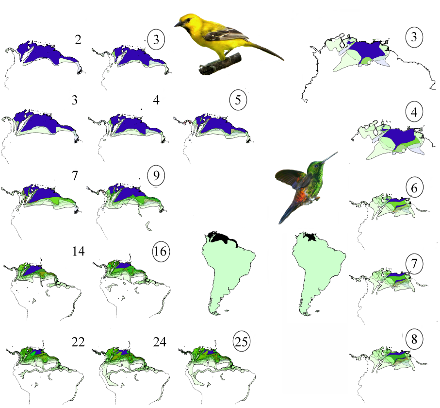

# SCAN_engine

 __SCAN app repository__ 

If you have R installed in your computer, to run SCAN_engine just type:

>library(shiny)

>runGitHub( "cassianogatto/SCAN_engine", "cassianogatto")

The **paper** is [here](https://journals.plos.org/plosone/article?id=10.1371/journal.pone.0245818) !

### What is SCAN about?
The paper presents a new concept in biogeography. SCAN network analysis allows a deeper understanding of species spatial relationships, and brings spatial congruence back as a central and explicit parameter in biogeographical analyses.

In Biogeography, the  field that studies the spatial distribution of species and the evolution of their environments, there is a pervasive question: - Why unrelated species often have similar geographic distributions?. Unfortunately, most methods approaching this do not use the spatial congruence as an explicit (and controlable) parameter. As SCAN is totally based in species-to-species spatial relationships in an enviroment of network analysis it allows the recovering of the most obvious spatial patterns of shared distributions, but also a plethora of other spatial relationships, including gradients of distribution, that cannot be approapriatelly described by conventional methods.
### Why is it important?

The algorithm applies objective criteria regarding the spatial properties of entities, such as species, environments and geographic regions, which can be analysed in depth. Recognized patterns may vary from highly congruent, with species showing almost the same distribution, to large and continuous gradients combining species replacing each other along a transition zone. This flexibility allows  the recognition of dynamics and evolution in spatial patterns, and also allows the comparison between species and regions based on natural criteria.

### Perspectives...
A Shiny app will be soon published (but is already available at https://github.com/cassianogatto/SCAN_engine). Meanwhile we are applying the method to the analysis of endemic patterns of South American Birds and Primates (with collaborators). SCAN is super intuitive, allows the gattering of tons of insights about species distributions, and now is fully converted to a standard network analysis (in R). Many network tools and concepts can now be integrated to biogeographical analysis.
