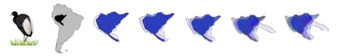

<h1 style = "float:letf;"> SCAN_engine </h1>

### What is SCAN about?
In Biogeography, the  field that studies the spatial distribution of species and the evolution of their environments, there is a pervasive question: - Why unrelated species often have similar geographic distributions?. Until now, most methods approaching this subject do not use the spatial congruence as an explicit (and controlable) parameter. As SCAN is totally based in species-to-species spatial relationships in an enviroment of network analysis it allows the recovering of the most obvious spatial patterns of shared distributions, but also a plethora of other spatial relationships, including gradients of distribution, that cannot be approapriatelly described by conventional methods.

### Why is it important?

The algorithm applies objective criteria regarding the spatial properties of entities, such as species, environments and geographic regions, which can be analysed in depth. Recognized patterns may vary from highly congruent, with species showing almost the same distribution, to large and continuous gradients combining species replacing each other along a transition zone. This flexibility allows  the recognition of dynamics and evolution in spatial patterns, and also allows the comparison between species and regions based on natural criteria.

 <table style = "border: 0px">
  <tr  style = "display: flex">
   <td width = 50% style = "float:left; align:center; ">
    <strong>SCAN app repository</strong> 
    
In this GIT version (0.21) SCAN needs a special environment until I update the code to run in newer versions of R.
p>
    
 Until there, you have to install
 [R version 4.2.2](https://cran.r-project.org/bin/windows/base/old/4.2.2/) 
 installed in your computer.

    
 Install
 [RStudio](https://posit.co/downloads/)
 and set R4.2.2 as the default version (tools/global options/ R general/ R version) -> C:\Program Files\R\R-4.2.2)

    
 To run SCAN_engine just type:

    <code>library(shiny)</code>
     
    <code>runGitHub( "cassianogatto/SCAN_engine", "cassianogatto")</code>
  </td>
  <td width = 45% style = "float:right; align:right">
    
  </td>
 </tr>
 </table>

The **paper** is [here](https://journals.plos.org/plosone/article?id=10.1371/journal.pone.0245818) !

SCAN - *Spatial Congruence Analysis* - is a network analysis bringing an intuitive framework to search for patterns defined by spatially congruent species in biogeography: it allows a deeper understanding of species spatial relationships, and brings pure __spatial congruence__ back as a central, continuous, and explicit parameter in biogeographical analyses.

### Perspectives...
A Shiny app will be soon published (but is already available at https://github.com/cassianogatto/SCAN_engine). Meanwhile we are applying the method to the analysis of endemic patterns of South American Birds and Primates (with collaborators). SCAN is super intuitive, allows the gattering of tons of insights about species distributions, and now is fully converted to a standard network analysis (in R). Many network tools and concepts can now be integrated to biogeographical analysis.
